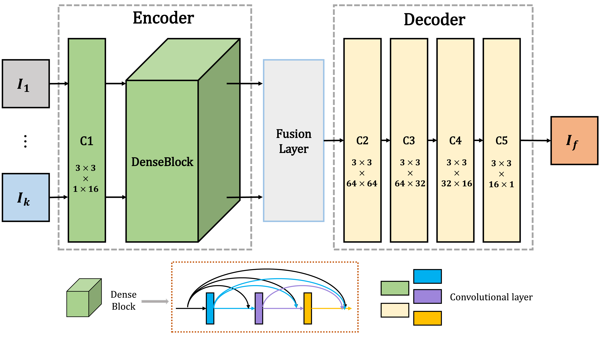
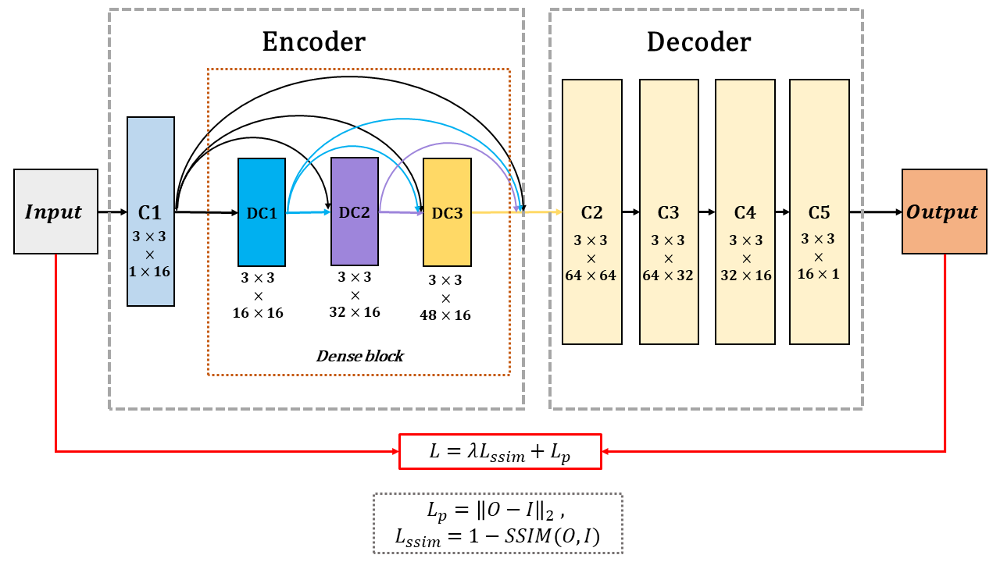

# DenseFuse

---

### The re-implementation of IEEE Transactions on Image Processing 2019 DeepFuse paper idea





This code is based on [H. Li, X. J. Wu, “DenseFuse: A Fusion Approach to Infrared and Visible Images,” IEEE Trans. Image Process., vol. 28, no. 5, pp. 2614–2623, May. 2019.](https://ieeexplore.ieee.org/document/8580578)

---

## Description 描述

- **基础框架：** AutoEncoder
- **任务场景：** 用于红外可见光图像融合，Infrared Visible Fusion (IVF)。
- **项目描述：** Densefuse 的 PyTorch 实现。fusion strategy 只用了最简单的addition。
- **论文地址：**
  - [arXiv](https://arxiv.org/abs/1804.08361)
  - [IEEEXplore](https://ieeexplore.ieee.org/document/8580578)
- **参考项目：**
  - [hli1221/imagefusion_densefuse](https://github.com/hli1221/imagefusion_densefuse) 官方代码基于tf
  - [hli1221/densefuse-pytorch](https://github.com/hli1221/densefuse-pytorch) 官方代码基于torch
  - [DenseFuse-Refactoring-of-PyTorch](https://github.com/LGNWJQ/DenseFuse-Refactoring-of-PyTorch/tree/main) 主要学习了这里的代码
  - [bsun0802/DenseFuse-pytorch](https://github.com/bsun0802/DenseFuse-pytorch) 这一篇看的比较少。在model.py中把fusion layer也写了进去，后续想完整复现融合策略可以参考这个的思路

---

## Idea 想法

In contrast to conventional convolutional networks, our encoding network is combined by convolutional neural network layer and dense block which the output of each layer is connected to every other layer. We attempt to use this architecture to get more useful features from source images in encoder process. Then appropriate fusion strategy is utilized to fuse these features. Finally, the fused image is reconstructed by decoder.

We train our network using [MS-COCO 2014](http://images.cocodataset.org/zips/train2014.zip)(T.-Y. Lin, M. Maire, S. Belongie, J. Hays, P. Perona, D. Ramanan, P. Dollar, and C. L. Zitnick. Microsoft coco: Common objects in context. In ECCV, 2014. 3-5.) as input images which contains 80000 images and all resize to 256×256 and RGB images are transformed to gray ones. Learning rate is 1×10^(-4). The batch size and epochs are 2 and 4, respectively.

---

## Structure 文件结构

```shell
├─data_test              # 用于测试的不同图片
│  ├─Road          	  	# Gray  可见光+红外
│  └─Tno           		# Gray  可见光+红外
│ 
├─data_result     # run_infer.py 的运行结果。使用训练好的权重对data_test内图像融合结果 
│  ├─pair           # 单对图像融合结果
│  ├─Road_fusion
│  └─TNO_fusion
|
├─models                        # 网络模型
│  └─DenseFuse
│ 
├─runs              # run_train.py 的运行结果
│  └─train_07-15_16-28
│     ├─checkpoints # 模型权重
│     └─logs        # 用于存储训练过程中产生的Tensorboard文件
|
├─utils      	                # 调用的功能函数
│  ├─util_dataset.py            # 构建数据集
│  ├─util_device.py        	# 运行设备 
│  ├─util_fusion.py             # 模型推理
│  ├─util_loss.py            	# 结构误差损失函数
│  ├─util_train.py            	# 训练用相关函数
│  └─utils.py                   # 其他功能函数
│ 
├─configs.py 	    # 模型训练超参数
│ 
├─run_infer.py   # 该文件使用训练好的权重将test_data内的测试图像进行融合
│ 
└─run_train.py      # 该文件用于训练模型

```

---
## Usage 使用说明

### Trainng

#### 从零开始训练

* 打开configs.py对训练参数进行设置：
* 参数说明：

| 参数名              | 说明                                                                              |
|------------------|---------------------------------------------------------------------------------|
| image_path       | 用于训练的数据集的路径                                                                     |
| gray             | 为`True`时会进入灰度图训练模式，生成的权重用于对单通道灰度图的融合; 为`False`时会进入彩色RGB图训练模式，生成的权重用于对三通道彩色图的融合; |
| train_num        | `MSCOCO/train2017`数据集包含**118,287**张图像，设置该参数来确定用于训练的图像的数量                        |
| resume_path      | 默认为None，设置为已经训练好的**权重文件路径**时可对该权重进行继续训练，注意选择的权重要与**gray**参数相匹配                  |
| device           | 模型训练设备 cpu or gpu                                                               |
| batch_size       | 批量大小                                                                            |
| num_workers      | 加载数据集时使用的CPU工作进程数量，为0表示仅使用主进程，（在Win10下建议设为0，否则可能报错。Win11下可以根据你的CPU线程数量进行设置来加速数据集加载） |
| learning_rate    | 训练初始学习率                                                                            |
| num_epochs       | 训练轮数                                                                               |

* 设置完成参数后，运行**run_train.py**即可开始训练：

```python
    # 数据集相关参数
    parser.add_argument('--image_path', default=r'E:/project/Image_Fusion/DATA/COCO/train2017', type=str, help='数据集路径')
    parser.add_argument('--gray', default=True, type=bool, help='是否使用灰度模式')
    parser.add_argument('--train_num', default=70000, type=int, help='用于训练的图像数量')
    # 训练相关参数
    parser.add_argument('--device', type=str, default=device_on(), help='训练设备')
    parser.add_argument('--batch_size', type=int, default=2, help='input batch size, default=INF_images')
    parser.add_argument('--num_epochs', type=int, default=4, help='number of epochs to train for, default=4')
    parser.add_argument('--lr', type=float, default=1e-4, help='select the learning rate, default=1e-4')
    parser.add_argument('--resume_path', default=None, type=str, help='导入已训练好的模型路径')
    parser.add_argument('--num_workers', type=int, default=0, help='载入数据集所调用的cpu线程数')
    # 打印输出
    parser.add_argument('--output', action='store_true', default=True, help="shows output")
```

* 你可以在运行窗口看到类似的如下信息：

```
==================模型超参数==================
----------数据集相关参数----------
image_path: ../dataset/COCO_train2014
gray_images: True
train_num: 80000
----------训练相关参数----------
device: cuda
batch_size: 16
num_epochs: 4
num_workers: 0
learning rate: 0.0001
resume_path: 
==================模型超参数==================
Loaded 80000 images
训练数据载入完成...
设备就绪...
Tensorboard 构建完成，进入路径：./runs\train_01-03_17-02\logs_Gray_epoch=4
然后使用该指令查看训练过程：tensorboard --logdir=./
测试数据载入完成...
initialize network with normal type
网络模型及优化器构建完成...
Epoch [1/4]: 100%|██████████| 5000/5000 [17:06<00:00,  4.87it/s, pixel_loss=0.0001, ssim_loss=0.0002, lr=0.000100]
Epoch [2/4]: 100%|██████████| 5000/5000 [12:23<00:00,  6.72it/s, pixel_loss=0.0002, ssim_loss=0.0000, lr=0.000090]
Epoch [3/4]: 100%|██████████| 5000/5000 [12:23<00:00,  6.73it/s, pixel_loss=0.0001, ssim_loss=0.0000, lr=0.000081]
Epoch [4/4]: 100%|██████████| 5000/5000 [09:15<00:00,  8.99it/s, pixel_loss=0.0000, ssim_loss=0.0000, lr=0.000073]
Finished Training
训练耗时：3072.27秒
Best loss: 0.000127
```

* Tensorboard查看训练细节：
  * **logs**文件夹下保存Tensorboard文件
  * 进入对于文件夹后使用该指令查看训练过程：`tensorboard --logdir=./`
  * 在浏览器打开生成的链接即可查看训练细节

#### 使用我提供的权重继续训练

* 打开args_fusion.py对训练参数进行设置
* 首先确定训练模式（Gray or RGB）
* 修改**resume_path**的默认值为已经训练过的权重文件路径

* 运行**run_train.py**即可运行


### Fuse Image

* 打开**run_infer.py**文件，调整**FusionConfig**参数
  * 确定融合模式（Gray or RGB）
  * 确定原图像路径和权重路径
  * 确定保存路径
* 运行**run_infer.py**
* 你可以在运行窗口看到如下信息：

```shell
runs/train_COCO/checkpoints/epoch003-loss0.000.pth model loaded.
Processing: 100%|██████████| 50/50 [00:01<00:00, 26.58it/s]
Processing completed:50/50 images successfully fused
Processing: 100%|██████████| 15/15 [00:01<00:00, 14.50it/s]
Processing completed:15/15 images successfully fused

```


