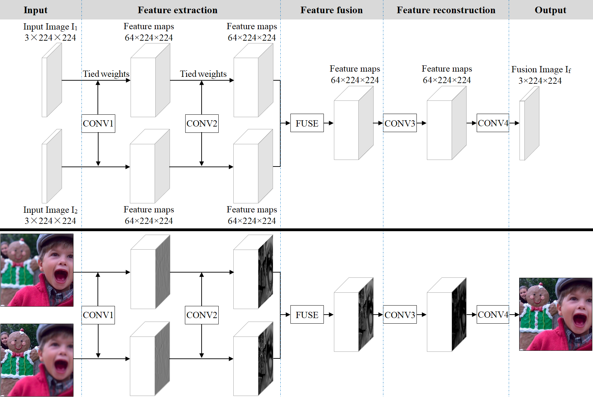

# IFCNN

---

### The re-implementation of Information Fusion 2020 IFCNN paper idea



This code is based on [Zhang, “IFCNN: A General Image Fusion Framework Based on Convolutional Neural Network”, Information Fusion, 54 (2020) 99-118](https://www.sciencedirect.com/science/article/abs/pii/S1566253518305505)

---

## Description 描述

- **基础框架：** CNN
- **任务场景：** 通用图像融合框架，General Image Fusion (IF)。
- **项目描述：** IFCNN 的 PyTorch 实现。无训练，只有推理过程，
- **论文地址：**
  - [sciencedirect](https://www.sciencedirect.com/science/article/pii/S1566253518305505)
- **参考项目：**
  - [uzeful/IFCNN](https://github.com/uzeful/IFCNN) 官方代码。

* 其实官方代码写的挺好的。虽然论文写的不大行。
---

## Idea 想法

一个通用的CNN图像融合框架。

---

## Structure 文件结构
```shell
├─ checkpoints_official          # 模型权重
│  ├─ IFCN-MAX.pth 
│  ├─ IFCN-MEAN.pth
│  └─ IFCN-SUM.pth 
│
├─ data_result                   # 推理结果
│ 
├─ data_test                     # 用于测试的不同图片
│  ├─ IVDataset                  # 红外可见光数据集
│  ├─ CMFDataset                 # 多聚焦数据集
│  ├─ CMF3Dataset                # 多聚焦数据集（三个输入）
│  └─ MEDataset                  # 多曝光数据集
│
├─models
│  ├─ IFCNN.py                   # 网络模型（自建） 
│  └─ IFCNN_official.py          # 网络模型（官方代码）
│ 
├─utils                          # 调用的功能函数
│  ├─util_device.py              # 运行设备 
│  └─util_fusion.py              # 模型推理
│ 
└─ run_infer.py                 # 该文件使用训练好的权重将test_data内的测试图像进行融合
```


## Usage 使用说明

### Fuse Image

* 打开**run_infer.py**文件，调整**defaults**参数
  * 确定原图像路径和权重路径
  * 确定保存路径
* 运行**run_fusion.py**
* 你可以在运行窗口看到如下信息：

```shell
checkpoints/IFCNN-MEAN.pth model loaded.
Total processing time of CMF dataset: 7.39s
Total processing time of IV dataset: 3.74s
```


