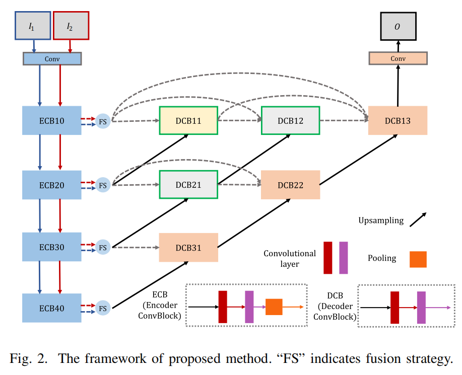
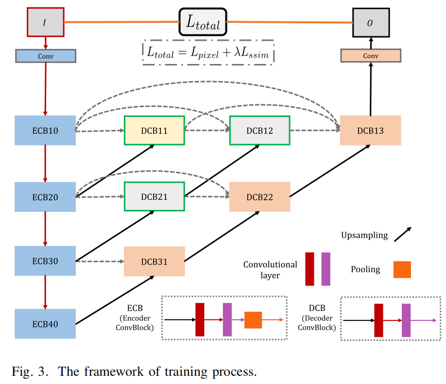

# NestFuse

---

### The re-implementation of IEEE Transactions 2020 NestFuse paper idea





This code is based on [H. Li, X. -J. Wu and T. Durrani, "NestFuse: An Infrared and Visible Image Fusion Architecture Based on Nest Connection and Spatial/Channel Attention Models," in IEEE Transactions on Instrumentation and Measurement, vol. 69, no. 12, pp. 9645-9656, Dec. 2020](https://ieeexplore.ieee.org/document/9127964)

---

## Description 描述

- **基础框架：** AutoEncoder
- **任务场景：** 用于红外可见光图像融合，Infrared Visible Fusion (IVF)。
- **项目描述：** Nestfuse 的 PyTorch 实现。fusion strategy 基于注意力机制。
- **论文地址：**
  - [arXiv](https://arxiv.org/abs/2007.00328)
  - [IEEEXplore](https://ieeexplore.ieee.org/document/9127964)
- **参考项目：**
  - [imagefusion-nestfuse](https://github.com/hli1221/imagefusion-nestfuse) 官方代码。
---

## Idea 想法

[MS-COCO 2014](http://images.cocodataset.org/zips/train2014.zip)(T.-Y. Lin, M. Maire, S. Belongie, J. Hays, P. Perona, D. Ramanan, P. Dollar, and C. L. Zitnick. Microsoft coco: Common objects in context. In ECCV, 2014. 3-5.) is utilized to train our auto-encoder network.

In our fusion strategy, we focus on two types of features: spatial attention model and channel attention model. The extracted multi-scale deep features are processed in two phases.

---

## Structure 文件结构

```shell
├─fusion_test_data              # 用于测试的不同图片
│  ├─Road          	  	# Gray  可见光+红外
│  └─Tno           		# Gray  可见光+红外
│ 
├─fusion_result    # run_fusion.py 的运行结果。使用训练好的权重对fusion_test_data内图像融合结果 
│ 
├─models       
│  ├─fusion_strategy            # 融合策略              
│  └─NestFuse_2020                   # 网络模型
│ 
├─runs              # run_train.py 的运行结果
│  └─train_02-22_07-29
│     ├─checkpoints # 模型权重
│     └─logs        # 用于存储训练过程中产生的Tensorboard文件
|
├─utils      	                # 调用的功能函数
│  ├─util_dataset.py            # 构建数据集
│  ├─util_device.py        	# 运行设备 
│  ├─util_fusion.py             # 模型推理
│  ├─util_loss.py            	# 结构误差损失函数
│  ├─util_train.py            	# 训练用相关函数
│  └─utils.py                   # 其他功能函数
│ 
├─configs.py 	    # 模型训练超参数
│ 
├─run_fusion.py   # 该文件使用训练好的权重将test_data内的测试图像进行融合
│ 
└─run_train.py      # 该文件用于训练模型

```


## 使用说明

### Trainng

#### 从零开始训练

* 打开configs.py对训练参数进行设置：
* 参数说明：

| 参数名              | 说明                                                                              |
|------------------|---------------------------------------------------------------------------------|
| image_path       | 用于训练的数据集的路径                                                                     |
| gray             | 为`True`时会进入灰度图训练模式，生成的权重用于对单通道灰度图的融合; 为`False`时会进入彩色RGB图训练模式，生成的权重用于对三通道彩色图的融合; |
| train_num        | `MSCOCO/train2017`数据集包含**118,287**张图像，设置该参数来确定用于训练的图像的数量                        |
| resume_path      | 默认为None，设置为已经训练好的**权重文件路径**时可对该权重进行继续训练，注意选择的权重要与**gray**参数相匹配                  |
| device           | 模型训练设备 cpu or gpu                                                               |
| batch_size       | 批量大小                                                                            |
| num_workers      | 加载数据集时使用的CPU工作进程数量，为0表示仅使用主进程，（在Win10下建议设为0，否则可能报错。Win11下可以根据你的CPU线程数量进行设置来加速数据集加载） |
| learning_rate    | 训练初始学习率                                                                            |
| num_epochs       | 训练轮数                                                                               |

* 设置完成参数后，运行**run_train.py**即可开始训练：

```python
    # 数据集相关参数
    parser.add_argument('--image_path', default=r'E:/project/Image_Fusion/DATA/COCO/train2017', type=str, help='数据集路径')
    parser.add_argument('--gray', default=True, type=bool, help='是否使用灰度模式')
    parser.add_argument('--train_num', default=10000, type=int, help='用于训练的图像数量')
    # 训练相关参数
    parser.add_argument('--resume_path', default=None, type=str, help='导入已训练好的模型路径')
    parser.add_argument('--device', type=str, default=device_on(), help='训练设备')
    parser.add_argument('--batch_size', type=int, default=4, help='input batch size, default=4')
    parser.add_argument('--num_workers', type=int, default=0, help='载入数据集所调用的cpu线程数')
    parser.add_argument('--num_epochs', type=int, default=10, help='number of epochs to train for, default=10')
    parser.add_argument('--lr', type=float, default=1e-4, help='select the learning rate, default=1e-2')
    # 打印输出
    parser.add_argument('--output', action='store_true', default=True, help="shows output")
```

* 你可以在运行窗口看到类似的如下信息：

```
Epoch [91/100]: 100%|██████████████████| 2500/2500 [06:59<00:00,  5.96it/s, learning_rate=7.62e-9, pixel_loss=6.46e-5, ssim_loss=-2.98e-7]
Epoch [92/100]: 100%|████████████████████| 2500/2500 [06:59<00:00,  5.96it/s, learning_rate=6.86e-9, pixel_loss=6.5e-5, ssim_loss=1.55e-6]
Epoch [93/100]: 100%|███████████████████| 2500/2500 [06:59<00:00,  5.96it/s, learning_rate=6.17e-9, pixel_loss=4.22e-5, ssim_loss=1.71e-6]
Epoch [94/100]: 100%|███████████████████| 2500/2500 [06:58<00:00,  5.97it/s, learning_rate=5.55e-9, pixel_loss=5.47e-5, ssim_loss=7.15e-7]
Epoch [95/100]: 100%|██████████████████████| 2500/2500 [06:58<00:00,  5.97it/s, learning_rate=5e-9, pixel_loss=7.07e-5, ssim_loss=6.95e-7]
Epoch [96/100]: 100%|████████████████████| 2500/2500 [06:58<00:00,  5.98it/s, learning_rate=4.5e-9, pixel_loss=5.83e-5, ssim_loss=1.55e-6]
Epoch [97/100]: 100%|███████████████████| 2500/2500 [06:59<00:00,  5.96it/s, learning_rate=4.05e-9, pixel_loss=3.71e-5, ssim_loss=3.97e-8]
Epoch [98/100]: 100%|████████████████████| 2500/2500 [06:58<00:00,  5.97it/s, learning_rate=3.64e-9, pixel_loss=1.8e-5, ssim_loss=1.21e-6]
Epoch [99/100]: 100%|███████████████████| 2500/2500 [06:59<00:00,  5.97it/s, learning_rate=3.28e-9, pixel_loss=6.91e-5, ssim_loss=3.28e-6]
Epoch [100/100]: 100%|██████████████████| 2500/2500 [06:59<00:00,  5.96it/s, learning_rate=2.95e-9, pixel_loss=4.66e-5, ssim_loss=1.69e-6]
Finished Training
训练耗时： 42113.36333203316
Best val loss: 0.000195
```

* Tensorboard查看训练细节：
  * **logs**文件夹下保存Tensorboard文件
  * 进入对于文件夹后使用该指令查看训练过程：`tensorboard --logdir=./`
  * 在浏览器打开生成的链接即可查看训练细节

#### 使用我提供的权重继续训练

* 打开args_fusion.py对训练参数进行设置
* 首先确定训练模式（Gray or RGB）
* 修改**resume_path**的默认值为已经训练过的权重文件路径

* 运行**run_train.py**即可运行


### Fuse Image

* 打开**run_fusion.py**文件，调整**defaults**参数
  * 确定融合模式（Gray or RGB）
  * 确定原图像路径和权重路径
  * 确定保存路径
* 运行**run_fusion.py**
* 你可以在运行窗口看到如下信息：

```shell
runs/train_02-22_07-29/checkpoints/epoch025-loss0.000.pth model loaded.
载入数据...
开始融合...
输出路径：fusion_result/fusion_result_Roadfusion1.png
输出路径：fusion_result/fusion_result_Roadfusion2.png
输出路径：fusion_result/fusion_result_Roadfusion3.png
输出路径：fusion_result/fusion_result_Roadfusion4.png
输出路径：fusion_result/fusion_result_Roadfusion5.png
输出路径：fusion_result/fusion_result_Roadfusion6.png
输出路径：fusion_result/fusion_result_Roadfusion7.png
输出路径：fusion_result/fusion_result_Roadfusion8.png
输出路径：fusion_result/fusion_result_Roadfusion9.png
输出路径：fusion_result/fusion_result_Roadfusion10.png
输出路径：fusion_result/fusion_result_Roadfusion11.png
```


