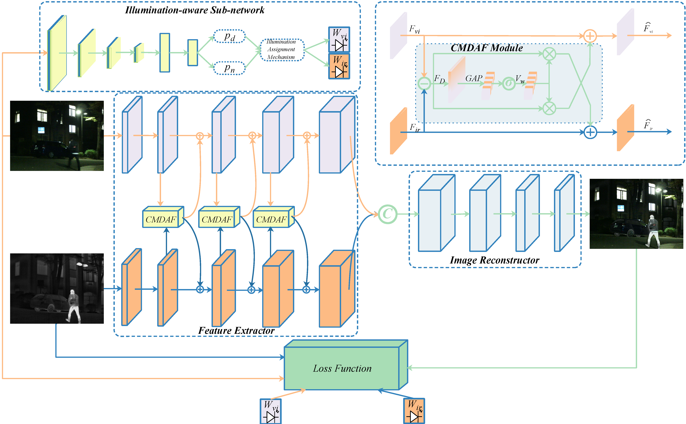
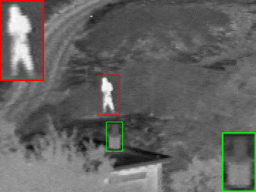

# PIAFusion

---

### The re-implementation of Information Fusion 2022 PIAFusion paper idea



This code is based on [Linfeng Tang, “PIAFusion: A progressive infrared and visible image fusion network based on illumination aware”, Information Fusion,Volum 83–84,2022,Pages 79-92](https://doi.org/10.1016/j.inffus.2022.03.007)

---

## Description 描述

- **基础框架：** CNN
- **任务场景：** 用于红外可见光图像融合，Infrared Visible Fusion (IVF)。
- **项目描述：** PIAFusion 的 PyTorch 实现。可见光和红外的图像融合。项目中是对可见光图像的Y通道和单通道红外图像进行融合，Y_f 再与原始可见光的Cr,Cb通道合并得到融合图像。
- **论文地址：**
  - [PIAFusion](https://doi.org/10.1016/j.inffus.2022.03.007)
  - [PIAFusion](https://www.sciencedirect.com/science/article/abs/pii/S156625352200032X)
- **参考项目：**
  - [Linfeng-Tang/PIAFusion](https://github.com/Linfeng-Tang/PIAFusion) 官方代码。
  - [linklist2/PIAFusion_pytorch](https://github.com/linklist2/PIAFusion_pytorch) 官方认证过的Pytorch代码，也是主要参考。

---

## Idea 想法

创新点在 损失函数 、跨模态融合模块 和 数据集 。

1、基于光照感知来确定损失函数权重. 设计了一个照明感知子网络用来估计光照并计算照光照概率,利用光照概率构建光照感知损失来指导融合网络训练。
光照感知网络本质上是一个分类器，它计算图像属于白天和夜间的概率。

2、提出了一种跨模态差分感知融合（CMDAF）模块来补偿差分信息。


3、发布了多光谱道路场景的数据集MSRS。

---

## Structure 文件结构

```shell
├─ checkpoints_official               # 官方训练好的权重文件
├─ data_train                            # 用于分类任务和融合任务的训练数据集
├─ data_result                      # run_infer.py 的运行结果。使用训练好的权重对fusion_test_data内图像融合结果 
├─ data_test                   # 用于测试的不同图片
│  ├─ MSRS
│  ├─ RoadScene
│  └─ TNO
│ 
├─ models                             # 模型文件
│  ├─ common.py                       # 用到的一些公共模块
│  ├─ cls_model.py                    # 光照感知子网络的网络模型
│  └─ fusion_model.py                 # PIAFusion 模型
│ 
├─ runs                               # 运行结果
│  ├─ train_05-15_21-57_cls_model
│  └─ train_05-15_22-56_fusion_model
│ 
├─ Tools                              # 工具函数
│  └─ plotRegionZoom.py               # 画中画效果
│ 
├─ utils                              # 调用的功能函数
│  ├─util.py                          # 辅助函数 
│  ├─util_dataset.py                  # 训练数据集
│  ├─util_device.py                   # 运行设备 
│  ├─util_loss.py                     # 损失函数 
│  └─util_train.py                    # 模型训练
│ 
├─ configs.py                         # 训练参数配置
├─ run_infer.py                      # 该文件使用训练好的权重将test_data内的测试图像进行融合
├─ run_train.py                       # 模型训练
├─ trans_illum_data.py                # 将data_illum.h5文件数据集转换为文件夹存放图片的形式
└─ trans_msrs_data.py                 # 将data_MSRS.h5文件数据集转换为文件夹存放图片的形式
```

---
## Usage 使用说明

### 1 数据准备(github官方代码提供下载链接)
#### 用于光照感知子网络的图片数据集（分类任务）
* 将 data_illum.h5 文件转换为图片格式：
  * 训练光照感知子网络的h5文件数据集在[data_illum.h5](https://pan.baidu.com/share/init?surl=D7XVGFyPgn9lH6JxYXt65Q&pwd=PIAF)。
  * 下载之后，将data_illum.h5文件移入项目中```data_train``` 文件夹。
  * 运行 **trans_illum_data.py** 文件，将h5文件还原为png格式的图片。

为了更直观观看训练的图片以及方便书写和调试代码， 本项目选择将h5文件还原为png格式的图片，使用下列命令转换：
```shell
python trans_illum_data.py --h5_path 'data_train/data_illum.h5' --cls_root_path 'data_train/cls_dataset'
```
运行结果：
```shell
100%|██████████| 56064/56064 [00:32<00:00, 1750.12it/s]
Image conversion and saving completed.
```
转换后的目录如下所示:
```shell
 cls_dataset
 ├── day
 │   ├── day_0.png
 │   ├── day_1.png
 │   ├── ......
 ├── night
 │   ├── night_0.png
 │   ├── night_1.png
 │   ├── ......
```

#### 用于PIAFusion主网络的图片数据集（融合任务）
* 将 data_MSRS.h5 文件转换为图片格式：
  * 训练融合网络所需的数据集链接：[data_MSRS.h5](https://pan.baidu.com/share/init?surl=D7XVGFyPgn9lH6JxYXt65Q&pwd=PIAF)。
  * 下载之后，将data_MSRS.h5文件移入项目中```data_train``` 文件夹。
  * 运行 **trans_msrs_data.py** 文件，将h5文件还原为png格式的图片。


使用下列命令转换为图片格式:
```shell
python trans_msrs_data.py --h5_path 'data_train/data_MSRS.h5' --msrs_root_path 'data_train/msrs_train'
```

运行结果：
```shell
100%|██████████| 26112/26112 [00:29<00:00, 899.46it/s]
Image conversion and saving completed.
```
转换后的目录如下所示:
```shell
 msrs_train
 ├── Inf
 │   ├── 0.png
 │   ├── 1.png
 │   ├── ......
 ├── Vis
 │   ├── 0.png
 │   ├── 1.png
 │   ├── ......
```

### 2 Trainng

#### 从零开始训练
* 打开configs.py对训练参数进行设置：
* 参数说明：

| 参数名             | 说明                                                                                  |
|-----------------|-------------------------------------------------------------------------------------|
| random_seed     | 随机数种子                                                                               |
| model_mode      | 判断训练模式，是'cls_model', 'fusion_model'二选一                                              |
| image_path_cls  | 用于训练分类模型的数据集路径                                                                      |
| image_path_fuse | 用于训练融合模型的数据集路径                                                                      |
| train_num       | 设置该参数来确定用于训练融合模型的图像的数量                                                              |
| device          | 模型训练设备 cpu or gpu                                                                   |
| resume_cls      | 默认为None，设置为已经训练好的**权重文件路径**时可对该权重进行继续训练，对应分类模型；在训练融合模型时需要指定                         |
| resume_fuse     | 默认为None，设置为已经训练好的**权重文件路径**时可对该权重进行继续训练，是融合模型的权重                                    |
| batch_size      | 批量大小                                                                                |
| num_workers     | 加载数据集时使用的CPU工作进程数量，为0表示仅使用主进程，（在Win10下建议设为0，否则可能报错。Win11下可以根据你的CPU线程数量进行设置来加速数据集加载） |
| learning_rate   | 训练初始学习率                                                                             |
| num_epochs      | 训练轮数                                                                                |

* 设置完成参数后，运行**run_train.py**即可开始训练：
* **model_mode='cls_model'**

```shell
==================模型超参数==================
----------数据集相关参数----------
model_mode: cls_model
image_path_cls: data_train/cls_dataset
image_path_fuse: data_train/msrs_train
train_num: 10000
----------训练相关参数----------
random_seed: 42
device: cpu
resume_cls: None
resume_fuse: None
batch_size: 4
num_workers: 0
num_epochs: 10
learning rate : 0.001
./runs\train_05-15_21-57_cls_model
==================模型超参数==================
设备就绪...
Tensorboard 构建完成，进入路径：./runs\train_05-15_21-57_cls_model\logs_cls_model_epoch=10
然后使用该指令查看训练过程：tensorboard --logdir=./
光照感知子网络训练阶段 数据载入完成...
网络模型及优化器构建完成...
Epoch [1/10]: 100%|██████████| 12615/12615 [01:34<00:00, 133.63it/s, learning_rate=0.001, loss_total=0.108]
100%|██████████| 1402/1402 [00:05<00:00, 242.53it/s]
Valid set: Average loss: 0.0671, Accuracy: 4983/5607 (88.87%)

Epoch [2/10]: 100%|██████████| 12615/12615 [01:21<00:00, 154.02it/s, learning_rate=0.001, loss_total=2.22e-5]
100%|██████████| 1402/1402 [00:04<00:00, 331.42it/s]
Valid set: Average loss: 0.0560, Accuracy: 5135/5607 (91.58%)

Epoch [3/10]: 100%|██████████| 12615/12615 [01:22<00:00, 153.38it/s, learning_rate=0.001, loss_total=0.000514]
100%|██████████| 1402/1402 [00:04<00:00, 326.69it/s]
Valid set: Average loss: 0.0595, Accuracy: 5132/5607 (91.53%)

Epoch [4/10]: 100%|██████████| 12615/12615 [01:22<00:00, 152.60it/s, learning_rate=0.001, loss_total=0.0215]
100%|██████████| 1402/1402 [00:04<00:00, 321.59it/s]
Valid set: Average loss: 0.0556, Accuracy: 5082/5607 (90.64%)

Epoch [5/10]: 100%|██████████| 12615/12615 [01:22<00:00, 152.18it/s, learning_rate=0.001, loss_total=0.0191]
100%|██████████| 1402/1402 [00:04<00:00, 319.19it/s]
Valid set: Average loss: 0.0386, Accuracy: 5273/5607 (94.04%)

Epoch [6/10]: 100%|██████████| 12615/12615 [01:23<00:00, 150.96it/s, learning_rate=0.001, loss_total=0.166]
100%|██████████| 1402/1402 [00:04<00:00, 326.98it/s]
Valid set: Average loss: 0.0471, Accuracy: 5221/5607 (93.12%)

Epoch [7/10]: 100%|██████████| 12615/12615 [01:42<00:00, 123.35it/s, learning_rate=0.0008, loss_total=0.000965]
100%|██████████| 1402/1402 [00:06<00:00, 222.34it/s]
Valid set: Average loss: 0.0274, Accuracy: 5381/5607 (95.97%)

Epoch [8/10]: 100%|██████████| 12615/12615 [01:33<00:00, 134.51it/s, learning_rate=0.0006, loss_total=0.0415]
100%|██████████| 1402/1402 [00:04<00:00, 312.78it/s]
Valid set: Average loss: 0.0244, Accuracy: 5406/5607 (96.42%)

Epoch [9/10]: 100%|██████████| 12615/12615 [01:32<00:00, 136.64it/s, learning_rate=0.0004, loss_total=0.000607]
100%|██████████| 1402/1402 [00:04<00:00, 296.09it/s]
Valid set: Average loss: 0.0254, Accuracy: 5407/5607 (96.43%)

Epoch [10/10]: 100%|██████████| 12615/12615 [01:28<00:00, 141.84it/s, learning_rate=0.0002, loss_total=0.000233]
100%|██████████| 1402/1402 [00:04<00:00, 301.97it/s]
Valid set: Average loss: 0.0223, Accuracy: 5429/5607 (96.83%)

Finished Training
训练耗时： 932.6015822887421
Best prec: 0.968254
```

* **model_mode='fusion_model'**
```shell
==================模型超参数==================
----------数据集相关参数----------
model_mode: fusion_model
image_path_cls: data_train/cls_dataset
image_path_fuse: data_train/msrs_train
train_num: 1000
----------训练相关参数----------
random_seed: 42
device: cpu
resume_cls: runs/train_05-15_21-57_cls_model/checkpoints/epoch009-prec0.968.pth
resume_fuse: None
batch_size: 4
num_workers: 0
num_epochs: 10
learning rate : 0.001
./runs\train_05-15_22-56_fusion_model
==================模型超参数==================
设备就绪...
Tensorboard 构建完成，进入路径：./runs\train_05-15_22-56_fusion_model\logs_fusion_model_epoch=10
然后使用该指令查看训练过程：tensorboard --logdir=./
PIAFusion 训练阶段 数据载入完成...
测试数据载入完成...
Resuming, initializing cls_model using weight from runs/train_05-15_21-57_cls_model/checkpoints/epoch009-prec0.968.pth.
Loading weights into state dict...
网络模型构建完成...
Epoch [1/10]: 100%|██████████| 250/250 [02:32<00:00,  1.64it/s, aux_loss=0.385, illum_loss=0.581, learning_rate=0.001, texture_loss=1.99, total_loss=2.95]
Epoch [2/10]: 100%|██████████| 250/250 [02:34<00:00,  1.62it/s, aux_loss=0.343, illum_loss=0.282, learning_rate=0.001, texture_loss=3.64, total_loss=4.27]
Epoch [3/10]: 100%|██████████| 250/250 [02:34<00:00,  1.61it/s, aux_loss=0.487, illum_loss=0.618, learning_rate=0.001, texture_loss=4.96, total_loss=6.07]
Epoch [4/10]: 100%|██████████| 250/250 [02:34<00:00,  1.61it/s, aux_loss=0.485, illum_loss=0.475, learning_rate=0.001, texture_loss=3.34, total_loss=4.3]
Epoch [5/10]: 100%|██████████| 250/250 [02:34<00:00,  1.61it/s, aux_loss=0.504, illum_loss=0.725, learning_rate=0.001, texture_loss=4.35, total_loss=5.58]
Epoch [6/10]: 100%|██████████| 250/250 [02:35<00:00,  1.61it/s, aux_loss=0.264, illum_loss=0.197, learning_rate=0.001, texture_loss=2.98, total_loss=3.44]
Epoch [7/10]: 100%|██████████| 250/250 [02:35<00:00,  1.60it/s, aux_loss=0.283, illum_loss=0.205, learning_rate=0.0008, texture_loss=2.51, total_loss=3]
Epoch [8/10]: 100%|██████████| 250/250 [02:35<00:00,  1.61it/s, aux_loss=0.254, illum_loss=0.251, learning_rate=0.0006, texture_loss=2.49, total_loss=2.99]
Epoch [9/10]: 100%|██████████| 250/250 [02:35<00:00,  1.61it/s, aux_loss=0.285, illum_loss=0.326, learning_rate=0.0004, texture_loss=2.95, total_loss=3.56]
Epoch [10/10]: 100%|██████████| 250/250 [02:35<00:00,  1.61it/s, aux_loss=0.231, illum_loss=0.312, learning_rate=0.0002, texture_loss=2.57, total_loss=3.11]
Finished Training
训练耗时： 1551.5867385864258
Best val loss: 3.558482
```

### 3 Infer 推理
* 设置完成参数后，运行**run_infer.py**即可开始推理。

### 4 画中画效果
 - 论文中图片对比时画中画效果：
  
   

请修改utils/plotRegionZoom.py中如下关键信息使用；
```shell
    region_list = [
        [137, 105, 167, 161],
        [149, 171, 172, 212]
    ]

    zoom_bool = [True, True]

    color_list = ['red', 'green']
    line_list = [1, 1]
    scale_list = [2, 2]
    place_list = ['top left', 'upper right']
    plotMultiRegion('39.bmp', region_list=region_list, line_width_list=line_list, color_list=color_list,
                    place_list=place_list, scale_list=scale_list, save_path='multiregion.bmp', zoom_bool=zoom_bool)
```

其中region_list表示需要框选的区域的坐标信息列表；zoom_bool表示是否将框选的区域放大；place_list表示将放大的区域放置在原图中的何处；
color_list表示框的颜色；line_list表示框的线条宽度；scale_list表示框选的区域放大的倍数；39.bmp替换成自己的图片路径；multiregion.bmp换成自己想要保存的路径；


