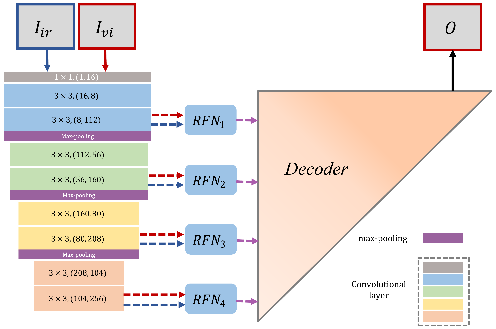
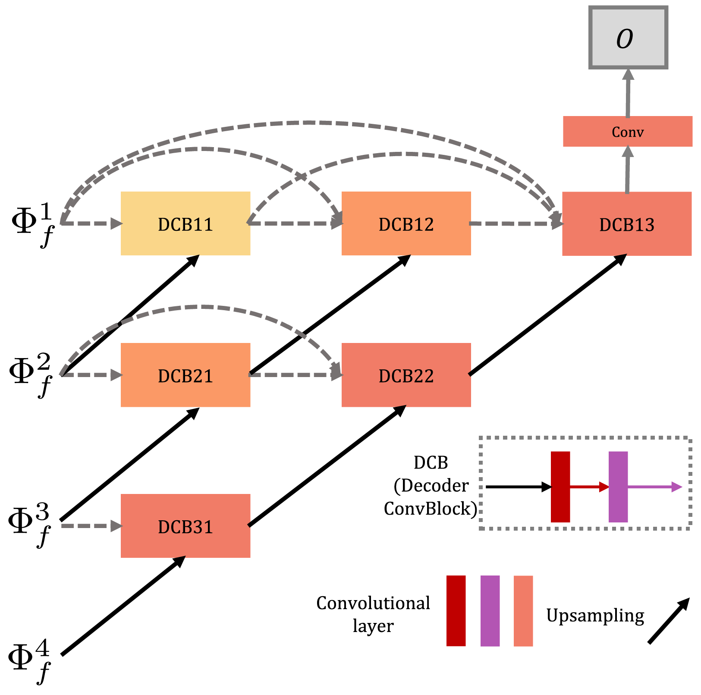

# RFN-Nest

---

### The re-implementation of Information Fusion 2021 RFN-Nest paper idea

#### framework


#### decoder


#### train-rfn


This code is based on [Hui Li, Xiao-Jun Wu*, Josef Kittler, "RFN-Nest: An end-to-end residual fusion network for infrared and visible images" in Information Fusion (IF:13.669), Volume: 73, Pages: 72-86, September 2021](https://www.sciencedirect.com/science/article/abs/pii/S1566253521000440?via%3Dihub)

---

## Description 描述

- **基础框架：** AutoEncoder
- **任务场景：** 用于红外可见光图像融合，Infrared Visible Fusion (IVF)。
- **项目描述：** RFN-Nest 的 PyTorch 实现。项目中是先将可见光RGB转为灰度图，进行两个灰度图的融合。
- **论文地址：**
  - [arXiv](https://arxiv.org/abs/2103.04286)
  - [ScienceDirect](https://www.sciencedirect.com/science/article/abs/pii/S1566253521000440?via%3Dihub)
- **参考项目：**
  - [imagefusion-rfn-nest](https://github.com/hli1221/imagefusion-rfn-nest) 官方代码。
  - 官方代码的融合策略中还整合了其他一些无需学习的融合算法。用于后续的实验对比。自己的代码里没有写其他融合算法。

---

## Idea 想法

[MS-COCO 2014](http://images.cocodataset.org/zips/train2014.zip) (T.-Y. Lin, M. Maire, S. Belongie, J. Hays, P. Perona, D. Ramanan, P. Dollar, and C. L. Zitnick. Microsoft coco: Common objects in context. In ECCV, 2014. 3-5.) is utilized to train our AutoEncoder network.

[KAIST](https://soonminhwang.github.io/rgbt-ped-detection/) (S. Hwang, J. Park, N. Kim, Y. Choi, I. So Kweon, Multispectral pedestrian detection: Benchmark dataset and baseline, in: Proceedings of the IEEE conference on computer vision and pattern recognition, 2015, pp. 1037–1045.) is utilized to train the RFN modules.

---


## Structure 文件结构

```shell
├─ data_test            # 用于测试的不同图片
│  ├─LLVIP          	# RGB可见光 + Gray红外
│  ├─Road          	  	# Gray  可见光+红外
│  └─Tno           		# Gray  可见光+红外
│ 
├─ data_result    # run_infer.py 的运行结果。使用训练好的权重对data_test内图像融合结果 
│ 
├─ models       
│  ├─ fusion_strategy            # 融合策略              
│  └─ NestFuse                   # 网络模型
│ 
├─runs              # run_train.py 的运行结果
│  └─train_02-22_07-29
│     ├─checkpoints # 模型权重
│     └─logs        # 用于存储训练过程中产生的Tensorboard文件
|
├─utils      	                # 调用的功能函数
│  ├─util_dataset.py            # 构建数据集
│  ├─util_device.py        	# 运行设备 
│  ├─util_fusion.py             # 模型推理
│  ├─util_loss.py            	# 结构误差损失函数
│  ├─util_train.py            	# 训练用相关函数
│  └─utils.py                   # 其他功能函数
│ 
├─configs.py 	    # 模型训练超参数
│ 
├─run_infer.py   # 该文件使用训练好的权重将test_data内的测试图像进行融合
│ 
└─run_train.py      # 该文件用于训练模型

```

## Usage 使用说明

### Trainng

#### 从零开始训练

* 打开configs.py对训练参数进行设置：
* 参数说明：

| 参数名           | 说明                                                                              |
|---------------|---------------------------------------------------------------------------------|
| RFN           | 判断训练阶段，if RFN=True，进入第二阶段训练；否则是训练autoencoder                                    |
| image_path_autoencoder    | 用于训练第一阶段的数据集的路径                                                                 |
| image_path_rfn    | 用于训练第二阶段的数据集的路径                                                                 |
| gray          | 为`True`时会进入灰度图训练模式，生成的权重用于对单通道灰度图的融合; 为`False`时会进入彩色RGB图训练模式，生成的权重用于对三通道彩色图的融合; |
| train_num     | `MSCOCO/train2017`数据集包含**118,287**张图像，设置该参数来确定用于训练的图像的数量                        |
| deepsupervision        | 是否使用NestFuse的深度监督训练                                                             |
| resume_nestfuse   | 默认为None，设置为已经训练好的**权重文件路径**时可对该权重进行继续训练，注意选择的权重要与**gray**参数相匹配                  |
| resume_rfn   | 默认为None，设置为已经训练好的**权重文件路径**时可对该权重进行继续训练，是rfn的权重                                 |
| device        | 模型训练设备 cpu or gpu                                                                   |
| batch_size    | 批量大小                                                                                |
| num_workers   | 加载数据集时使用的CPU工作进程数量，为0表示仅使用主进程，（在Win10下建议设为0，否则可能报错。Win11下可以根据你的CPU线程数量进行设置来加速数据集加载） |
| learning_rate | 训练初始学习率                                                                             |
| num_epochs    | 训练轮数                                                                                |

* 设置完成参数后，运行**run_train.py**即可开始训练：

```python
def set_args():
    parser = argparse.ArgumentParser(description="模型参数设置")
    parser.add_argument('--RFN',
                        default=False, type=bool, help='判断训练阶段')
    parser.add_argument('--image_path_autoencoder',
                        default=r'E:/project/Image_Fusion/DATA/COCO/train2017', type=str, help='数据集路径')
    parser.add_argument('--image_path_rfn',
                        default=r'E:/project/Image_Fusion/DATA/RoadScene_dataset', type=str, help='数据集路径')
    parser.add_argument('--gray',
                        default=True, type=bool, help='是否使用灰度模式')
    parser.add_argument('--train_num',
                        default=4, type=int, help='用于训练的图像数量')
    # 训练相关参数
    parser.add_argument('--deepsupervision', default=False, type=bool, help='是否深层监督多输出')
    parser.add_argument('--resume_nestfuse',
                        default=None, type=str, help='导入已训练好的模型路径')
    parser.add_argument('--resume_rfn',
                        default=None, type=str, help='导入已训练好的模型路径')
    parser.add_argument('--device', type=str, default=device_on(), help='训练设备')
    parser.add_argument('--batch_size', type=int, default=2, help='input batch size, default=4')
    parser.add_argument('--num_workers', type=int, default=0, help='载入数据集所调用的cpu线程数')
    parser.add_argument('--num_epochs', type=int, default=2, help='number of epochs to train for, default=10')
    parser.add_argument('--lr', type=float, default=1e-4, help='select the learning rate, default=1e-2')
    # 打印输出
    parser.add_argument('--output', action='store_true', default=True, help="shows output")
    # 使用parse_args()解析参数
    args = parser.parse_args()
```

* 你可以在运行窗口看到类似的如下信息：

```
autoencoder training:
==================模型超参数==================
----------数据集相关参数----------
image_path_autoencoder: /data/public/coco/train2017
image_path_rfn: /data/public/LLVIP
gray_images: True
train_num: 10000
----------训练相关参数----------
RFN: False
deepsupervision: False
resume_nestfuse: None
resume_rfn: None
device: cuda
batch_size: 4
num_workers: 10
num_epochs: 10
learning rate : 0.0001
==================模型超参数==================
设备就绪...
Tensorboard 构建完成，进入路径：./runs/train_04-11_12-52/logs_Gray_epoch=10
然后使用该指令查看训练过程：tensorboard --logdir=./
autoencoder 阶段训练数据载入完成...
测试数据载入完成...
initialize network with normal type
网络模型及优化器构建完成...
Epoch [1/10]: 100%|█| 2500/2500 [21:07<00:00,  1.97it/s, learning_rate=0.0001, pixel_loss=0.00346, ssim_los
Epoch [2/10]: 100%|█| 2500/2500 [20:43<00:00,  2.01it/s, learning_rate=9e-5, pixel_loss=0.2, ssim_loss=0.52
Epoch [3/10]: 100%|█| 2500/2500 [20:11<00:00,  2.06it/s, learning_rate=8.1e-5, pixel_loss=0.263, ssim_loss=
Epoch [4/10]: 100%|█| 2500/2500 [20:07<00:00,  2.07it/s, learning_rate=7.29e-5, pixel_loss=0.255, ssim_loss
Epoch [5/10]: 100%|█| 2500/2500 [20:03<00:00,  2.08it/s, learning_rate=6.56e-5, pixel_loss=0.269, ssim_loss
Epoch [6/10]: 100%|█| 2500/2500 [20:03<00:00,  2.08it/s, learning_rate=5.9e-5, pixel_loss=0.322, ssim_loss=
Epoch [7/10]: 100%|█| 2500/2500 [20:26<00:00,  2.04it/s, learning_rate=5.31e-5, pixel_loss=0.00136, ssim_lo
Epoch [8/10]: 100%|█| 2500/2500 [20:35<00:00,  2.02it/s, learning_rate=4.78e-5, pixel_loss=0.000307, ssim_l
Epoch [9/10]: 100%|█| 2500/2500 [20:34<00:00,  2.03it/s, learning_rate=4.3e-5, pixel_loss=0.000134, ssim_lo
Epoch [10/10]: 100%|█| 2500/2500 [20:33<00:00,  2.03it/s, learning_rate=3.87e-5, pixel_loss=0.000243, ssim_
Finished Training
训练耗时： 12278.722757577896
Best val loss: 0.086511


rfn training:
==================模型超参数==================
----------数据集相关参数----------
image_path_autoencoder: /data/public/coco/train2017
image_path_rfn: /data/public/LLVIP
gray_images: True
train_num: 10000
----------训练相关参数----------
RFN: True
deepsupervision: False
resume_nestfuse: /model/ziqi/Image_Fusion/RFN-Nest/runs/train_04-11_12-52/checkpoints/epoch009-loss0.087.pth
resume_rfn: None
device: cuda
batch_size: 2
num_workers: 10
num_epochs: 10
learning rate : 0.0001
==================模型超参数==================
设备就绪...
Tensorboard 构建完成，进入路径：./runs/train_04-11_16-25/logs_Gray_epoch=10
然后使用该指令查看训练过程：tensorboard --logdir=./
fpn 阶段训练数据载入完成...
测试数据载入完成...
Resuming, initializing auto-encoder using weight from /model/ziqi/Image_Fusion/RFN-Nest/runs/train_04-11_12-52/checkpoints/epoch009-loss0.087.pth.
Loading weights into state dict...
initialize network with normal type
网络模型及优化器构建完成...
Epoch [1/10]: 100%|█| 5000/5000 [30:31<00:00,  2.73it/s, detail_loss=0.43, feature_loss=0.00199, learning_ra
Epoch [2/10]: 100%|█| 5000/5000 [30:28<00:00,  2.73it/s, detail_loss=0.495, feature_loss=0.00117, learning_r
Epoch [3/10]: 100%|█| 5000/5000 [30:24<00:00,  2.74it/s, detail_loss=0.468, feature_loss=0.000828, learning_
Epoch [4/10]: 100%|█| 5000/5000 [30:18<00:00,  2.75it/s, detail_loss=0.501, feature_loss=0.00103, learning_r
Epoch [5/10]: 100%|█| 5000/5000 [30:17<00:00,  2.75it/s, detail_loss=0.441, feature_loss=0.000863, learning_
Epoch [6/10]: 100%|█| 5000/5000 [30:19<00:00,  2.75it/s, detail_loss=0.451, feature_loss=0.000704, learning_
Epoch [7/10]: 100%|█| 5000/5000 [30:21<00:00,  2.75it/s, detail_loss=0.531, feature_loss=0.000516, learning_
Epoch [8/10]: 100%|█| 5000/5000 [30:25<00:00,  2.74it/s, detail_loss=0.543, feature_loss=0.000658, learning_
Epoch [9/10]: 100%|█| 5000/5000 [30:15<00:00,  2.75it/s, detail_loss=0.46, feature_loss=0.000648, learning_r
Epoch [10/10]: 100%|█| 5000/5000 [30:16<00:00,  2.75it/s, detail_loss=0.5, feature_loss=0.000879, learning_r
Finished Training
训练耗时： 18244.081510782242
Best val loss: 0.000928
```

* Tensorboard查看训练细节：
  * **logs**文件夹下保存Tensorboard文件
  * 进入对于文件夹后使用该指令查看训练过程：`tensorboard --logdir=./`
  * 在浏览器打开生成的链接即可查看训练细节

#### 使用我提供的权重继续训练

* 打开args_fusion.py对训练参数进行设置
* 首先确定训练模式（Gray or RGB）
* 修改**resume_path**的默认值为已经训练过的权重文件路径

* 运行**run_train.py**即可运行


### Fuse Image

* 打开**run_infer.py**文件，调整**defaults**参数
  * 确定融合模式（Gray or RGB）
  * 确定原图像路径和权重路径
  * 确定保存路径
* 运行**run_infer.py**


