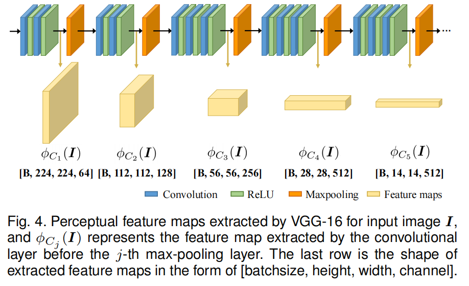

# U2Fusion

---

### The re-implementation of TPAMI 2020 U2Fusion paper idea

#### framework


#### DenseNet


#### FeatureExtraction


This code is based on [Xu H , Ma J , Jiang J , et al."U2Fusion: A Unified Unsupervised Image Fusion Network" in IEEE Transactions on Pattern Analysis and Machine Intelligence, 2020.](https://ieeexplore.ieee.org/abstract/document/9151265)

---

## Description 描述

- **基础框架：** CNN
- **任务场景：** 通用图像融合
- **项目描述：** U2Fusion 的 PyTorch 实现。只用于多模态融合（红外可见光融合）任务，没有EWC相关的代码。
- **论文地址：**
  - [IEEEXplore](https://ieeexplore.ieee.org/document/9151265)
- **参考项目：**
  - [hanna-xu/U2Fusion](https://github.com/hanna-xu/U2Fusion) 官方代码用tensorflow实现。
  - [hanna-xu/RoadScene](https://github.com/hanna-xu/RoadScene) 论文提出的RoadScene数据集。
  - [ytZhang99/U2Fusion-pytorch](https://github.com/ytZhang99/U2Fusion-pytorch) 论文主要参考。

---

## Idea 想法
  - 用于各种图像融合任务的统一框架：统一，无监督，端到端
  - 引入信息测量和信息保留度的概念：特征提取，信息度量，得到的信息保留度作为损失函数的权重项
  - 针对多任务图像融合，采取连续学习-弹性权重整合（elastic weight consolidation，EWC）方法

---

## Structure 文件结构

```shell
├─data_test              # 用于测试的不同图片
│  ├─Road          	  	# Gray  可见光+红外
│  └─Tno           		# Gray  可见光+红外
│ 
├─data_result     # run_infer.py 的运行结果。使用训练好的权重对data_test内图像融合结果 
│  ├─pair           # 单对图像融合结果
│  ├─Road_fusion
│  └─TNO_fusion
|
├─models                        # 网络模型
│  └─DenseNet
│ 
├─runs              # run_train.py 的运行结果
│  └─ttrain_04-02_14-43
│     ├─checkpoints # 模型权重
│     └─logs        # 用于存储训练过程中产生的Tensorboard文件
|
├─utils      	                # 调用的功能函数
│  ├─util_dataset.py            # 构建数据集
│  ├─util_device.py        	# 运行设备 
│  ├─util_fusion.py             # 模型推理
│  ├─util_loss.py            	# 结构误差损失函数
│  ├─util_train.py            	# 训练用相关函数
│  └─utils.py                   # 其他功能函数
│ 
├─configs.py 	    # 模型训练超参数
│ 
├─run_infer.py   # 该文件使用训练好的权重将test_data内的测试图像进行融合
│ 
└─run_train.py      # 该文件用于训练模型

```


---
## Usage 使用说明

### Trainng

#### 从零开始训练

* 打开configs.py对训练参数进行设置：
* 参数说明：

| 参数名              | 说明                                                                              |
|------------------|---------------------------------------------------------------------------------|
| image_path       | 用于训练的数据集的路径                                                                     |
| train_num        | `MSCOCO/train2017`数据集包含**118,287**张图像，设置该参数来确定用于训练的图像的数量                        |
| resume_path      | 默认为None，设置为已经训练好的**权重文件路径**时可对该权重进行继续训练，注意选择的权重要与**gray**参数相匹配                  |
| device           | 模型训练设备 cpu or gpu                                                               |
| batch_size       | 批量大小                                                                            |
| num_workers      | 加载数据集时使用的CPU工作进程数量，为0表示仅使用主进程，（在Win10下建议设为0，否则可能报错。Win11下可以根据你的CPU线程数量进行设置来加速数据集加载） |
| learning_rate    | 训练初始学习率                                                                            |
| num_epochs       | 训练轮数                                                                               |

* 设置完成参数后，运行**run_train.py**即可开始训练：

```python
    # 数据集相关参数
    parser.add_argument('--image_path', default=r'E:/project/Image_Fusion/DATA/RoadScene_dataset', type=str, help='数据集路径')
    parser.add_argument('--gray', default=True, type=bool, help='是否使用灰度模式')
    parser.add_argument('--train_num', default=10000, type=int, help='用于训练的图像数量')
    # 训练相关参数
    parser.add_argument('--resume_path', default=None, type=str, help='导入已训练好的模型路径')
    parser.add_argument('--device', type=str, default=device_on(), help='训练设备')
    parser.add_argument('--batch_size', type=int, default=4, help='input batch size, default=4')
    parser.add_argument('--num_workers', type=int, default=0, help='载入数据集所调用的cpu线程数')
    parser.add_argument('--num_epochs', type=int, default=10, help='number of epochs to train for, default=10')
    parser.add_argument('--lr', type=float, default=1e-4, help='select the learning rate, default=1e-2')
    # 打印输出
    parser.add_argument('--output', action='store_true', default=True, help="shows output")
```

* 你可以在运行窗口看到类似的如下信息：

```
==================模型超参数==================
----------数据集相关参数----------
image_path: E:/project/Image_Fusion/DATA/RoadScene_dataset
train_num: 200
----------训练相关参数----------
device: None
device: cpu
batch_size: 4
num_workers: 0
num_epochs: 50
learning rate : 0.0001
==================模型超参数==================
训练数据载入完成...
设备就绪...
Tensorboard 构建完成，进入路径：./runs\train_04-02_14-43\logsepoch=50
然后使用该指令查看训练过程：tensorboard --logdir=./
测试数据载入完成...
initialize network with normal type
网络模型及优化器构建完成...
Epoch [1/50]: 100%|██████████| 50/50 [00:17<00:00,  2.82it/s, learning_rate=0.0001, pixel_loss=0.0314, ssim_loss=0.182]
Epoch [2/50]: 100%|██████████| 50/50 [00:19<00:00,  2.62it/s, learning_rate=9e-5, pixel_loss=0.0762, ssim_loss=0.258]
Epoch [3/50]: 100%|██████████| 50/50 [00:18<00:00,  2.67it/s, learning_rate=8.1e-5, pixel_loss=0.029, ssim_loss=0.249]
Epoch [4/50]: 100%|██████████| 50/50 [00:18<00:00,  2.66it/s, learning_rate=7.29e-5, pixel_loss=0.0424, ssim_loss=0.159]
Epoch [5/50]: 100%|██████████| 50/50 [00:18<00:00,  2.65it/s, learning_rate=6.56e-5, pixel_loss=0.051, ssim_loss=0.232]
Epoch [6/50]: 100%|██████████| 50/50 [00:18<00:00,  2.65it/s, learning_rate=5.9e-5, pixel_loss=0.0403, ssim_loss=0.298]
Epoch [7/50]: 100%|██████████| 50/50 [00:18<00:00,  2.67it/s, learning_rate=5.31e-5, pixel_loss=0.022, ssim_loss=0.26]
Epoch [8/50]: 100%|██████████| 50/50 [00:18<00:00,  2.64it/s, learning_rate=4.78e-5, pixel_loss=0.0449, ssim_loss=0.259]
......
Epoch [45/50]: 100%|██████████| 50/50 [00:19<00:00,  2.62it/s, learning_rate=9.7e-7, pixel_loss=0.0605, ssim_loss=0.256]
Epoch [46/50]: 100%|██████████| 50/50 [00:19<00:00,  2.63it/s, learning_rate=8.73e-7, pixel_loss=0.0549, ssim_loss=0.244]
Epoch [47/50]: 100%|██████████| 50/50 [00:18<00:00,  2.63it/s, learning_rate=7.86e-7, pixel_loss=0.028, ssim_loss=0.291]
Epoch [48/50]: 100%|██████████| 50/50 [00:19<00:00,  2.63it/s, learning_rate=7.07e-7, pixel_loss=0.0456, ssim_loss=0.194]
Epoch [49/50]: 100%|██████████| 50/50 [00:18<00:00,  2.64it/s, learning_rate=6.36e-7, pixel_loss=0.0372, ssim_loss=0.31]
Epoch [50/50]: 100%|██████████| 50/50 [00:18<00:00,  2.65it/s, learning_rate=5.73e-7, pixel_loss=0.0489, ssim_loss=0.216]
Finished Training
训练耗时： 965.3936777114868
Best val loss: 21.221090
```

* Tensorboard查看训练细节：
  * **logs**文件夹下保存Tensorboard文件
  * 进入对于文件夹后使用该指令查看训练过程：`tensorboard --logdir=./`
  * 在浏览器打开生成的链接即可查看训练细节

#### 使用我提供的权重继续训练

* 打开args_fusion.py对训练参数进行设置
* 首先确定训练模式（Gray or RGB）
* 修改**resume_path**的默认值为已经训练过的权重文件路径

* 运行**run_train.py**即可运行


### Fuse Image

* 打开**run_fusion.py**文件，调整**defaults**参数
  * 确定原图像路径和权重路径
  * 确定保存路径
* 运行**run_fusion.py**
* 你可以在运行窗口看到如下信息：

```shell
runs/train_02-22_07-29/checkpoints/epoch025-loss0.000.pth model loaded.
载入数据...
开始融合...
```


